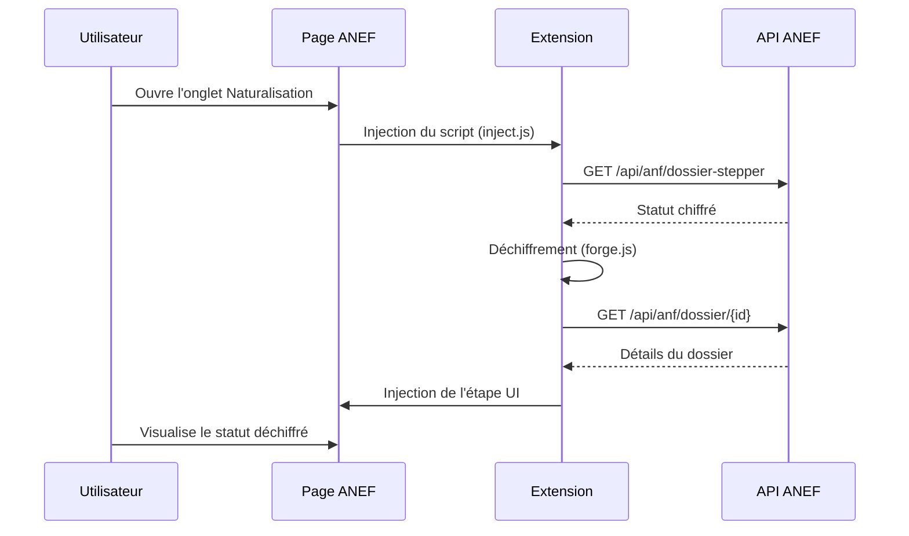

# ANEF – Statut du dossier de naturalisation

[](https://github.com/samirelhassani1998/ANEF_API)
[](./LICENSE)
[](https://developer.chrome.com/docs/extensions/)

Extension Chrome non officielle permettant de mieux suivre l'avancement de son dossier de naturalisation sur le portail ANEF
(*Administration numérique pour les étrangers en France*).

## 🎯 Objectif

L'interface ANEF ne montre qu'une frise générique (demande envoyée, examen des pièces, etc.) et cache les statuts techniques
utilisés en interne par l'administration (codes chiffrés).

Cette extension vous permet de :

- 🔓 **Déchiffrer le statut technique** de votre dossier
- 📊 **Ajouter une étape complémentaire** sur la frise avec une description compréhensible
- ℹ️ **Afficher un infobulle détaillé** avec l'intitulé "métier", le code technique et la date de mise à jour
- 📅 **Exposer des informations complémentaires** (entretien d'assimilation, décret, récépissé de complétude, etc.)

## ✨ Fonctionnalités

| Fonctionnalité | Description |
|----------------|-------------|
| **Déchiffrement du statut** | Décrypte le code statut chiffré renvoyé par l'API ANEF |
| **Traduction en langage clair** | Transforme les codes techniques en phrases lisibles |
| **Étape visuelle supplémentaire** | Ajoute une étape sur la frise avec icône et temps écoulé |
| **Infobulle détaillé** | Affiche le code technique complet et la date exacte au survol |
| **Date d'entretien d'assimilation** | Affiche la date et plateforme de l'entretien si disponible |
| **Récépissé de complétude** | Indique la date de réception du récépissé |
| **Décret de naturalisation** | Affiche les informations du décret le cas échéant |
| **Demande de complément** | Signale les demandes de pièces complémentaires |

## 🏗️ Architecture technique

```
ANEF_API/
├── manifest.json       # Configuration de l'extension Chrome (Manifest V3)
├── inject.js           # Script d'injection dans la page ANEF
├── content.js          # Logique principale : appels API, déchiffrement, UI
├── forge.min.js        # Bibliothèque de cryptographie (node-forge)
├── icons/              # Icônes de l'extension (16, 48, 128 px)
│   ├── icon16.png
│   ├── icon48.png
│   └── icon128.png
├── LICENSE             # Licence MIT
└── README.md           # Ce fichier
```

### Flux de fonctionnement



## ⚙️ Comment ça marche

1. **Injection** : Lors du chargement de l'onglet **« Demande d'accès à la Nationalité Française »** sur le site ANEF, l'extension injecte un script dans la page.

2. **Appel API** : Le script appelle les API ANEF (`/api/anf/dossier-stepper`, `/api/anf/dossier/{id}`) en réutilisant la session de l'utilisateur.

3. **Déchiffrement** : Le statut chiffré renvoyé par l'API est déchiffré en local via la bibliothèque `forge.js` et traduit en une phrase lisible (ex. : « Préfecture : En attente affectation à un agent »).

4. **Affichage UI** : Une nouvelle étape est ajoutée sur la frise ANEF avec :
   - 🔴 Une icône sablier rouge
   - 📝 Une description courte du statut
   - ⏱️ Un rappel du temps écoulé (ex. « il y a 22 jrs »)

5. **Infobulle** : Un survol de cette étape affiche un infobulle détaillé avec le code technique et la date exacte.

## 📦 Installation (mode développeur)

1. **Cloner le dépôt** :
   ```bash
   git clone https://github.com/samirelhassani1998/ANEF_API.git
   ```
   Ou télécharger le ZIP via GitHub puis le décompresser.

2. **Ouvrir Chrome** et naviguer vers `chrome://extensions`

3. **Activer le Mode développeur** (toggle en haut à droite)

4. **Charger l'extension** : Cliquer sur **« Charger l'extension non empaquetée »** et sélectionner le dossier du projet

5. **Vérifier l'installation** : Se connecter au portail ANEF et ouvrir l'onglet **« Demande d'accès à la Nationalité Française »**

6. **Confirmer** : L'icône de l'extension apparaît dans Chrome et une étape supplémentaire s'affiche sur la frise

## 🔐 Sécurité et confidentialité

- ✅ **Aucune donnée externe** : Toutes les données restent entre vous et le serveur ANEF
- ✅ **Pas de tracking** : Aucune télémétrie ni analyse d'usage
- ✅ **Déchiffrement local** : Le décryptage s'effectue entièrement dans votre navigateur
- ✅ **Code source ouvert** : Vous pouvez auditer le code à tout moment

## 🖼️ Icônes

Les icônes de l'extension (16, 48, 128 px) utilisent la Marianne issue du projet open source `status_naturalisation`.

## 📋 Versions

| Version | Changements |
|---------|-------------|
| **2.7** | UI simplifiée (2 lignes), CSS compact |
| **2.6** | Amélioration de l'affichage des infobulles |
| **2.5** | Ajout des informations de complément d'instruction |
| **2.4** | Support du décret et récépissé de complétude |

## 🤝 Contribuer

Les contributions sont les bienvenues ! N'hésitez pas à :

1. Fork le projet
2. Créer une branche pour votre fonctionnalité (`git checkout -b feature/ma-fonctionnalite`)
3. Commiter vos changements (`git commit -m 'Ajout de ma fonctionnalité'`)
4. Pousser sur la branche (`git push origin feature/ma-fonctionnalite`)
5. Ouvrir une Pull Request

## ⚠️ Avertissements

> **Note importante**
> - Cette extension n'est pas un service officiel de l'État français.
> - Les informations affichées sont issues des API ANEF mais leur interprétation est fournie à titre purement indicatif.
> - Utilisation à vos risques et périls ; vérifiez toujours votre situation auprès de l'administration compétente.

## 📄 Licence

Ce projet est sous licence MIT. Voir le fichier [LICENSE](./LICENSE) pour plus de détails.
